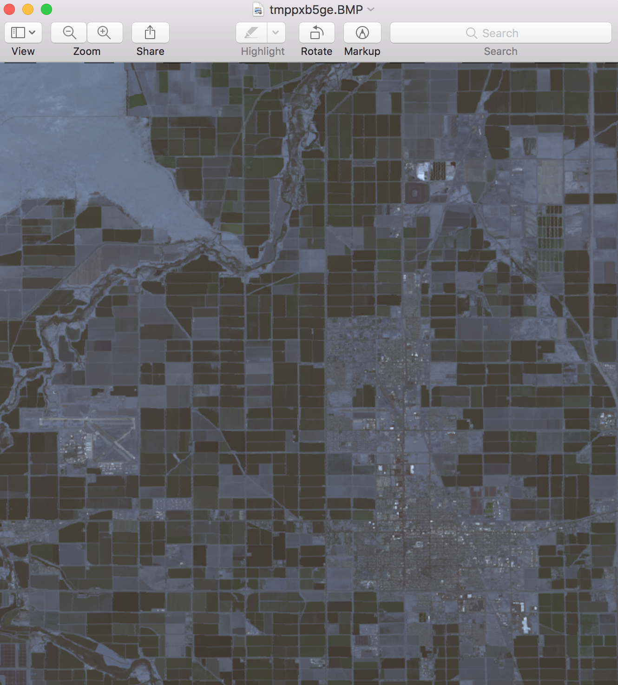

Aether Alpha Program
====================

Welcome to Aether!

This repository serves as the primary public interface for all users of the Aether data platform. By having been introduced into the alpha program, we ask kindly that you help us and our developers create the next build of Aether around your needs. 

You can post messages to this public repository through the "Issues" tab above to list feature requests, bug problems, or otherwise discuss your needs for remote sensing, satellite imagery, and geospatial data. We are here to build a community around users of these technologies and to foster great development.

What is Aether?
===============

So glad you asked! See, we're off to a great start.

The Aether platform is a system of applications and utilities for developers to rapidly and easily build algorithms that use satellite and geospatial data. The Aether platform is accessible by REST API and python, but operates entirely in the cloud using deferred graphs. This allows developers to build and execute applications with processing abstracted away and minimal data transfer. An important consequence of this design choice is that the same algorithm code developers use during exploration can be repackaged and deployed as mobile or web applications. These applications are entirely portable, and can be published to users or other developers through a simple URL key.

In that regard, the Aether platform is an SDK for satellite analytics and framework for mobile end user applications.

Our data platform documentation aims to answer many of your questions: https://github.com/davidbernat/aether-alpha-program/edit/master/README.md
-----------------------------------------------------------------------------------------------------------------------------------------------------------------------

Show me how easy Aether can be.
===============================

1) Get the developer software using pip:

        ``pip install aether``

2) Sign in to the Aether web portal to receive your unique user Id (UUID):

        `Sign In to Aether to get your UUID. <http://www.runsonaether.com/welcome.html>`_

3) Want data now? Download LandSat-8 data immediately.

.. code-block:: python

    import aether as ae
    uuid = "your_UUID"
    user = ae.register(uuid)
    ae.Sky().UpgradeUserToDeveloper()

    user_info = ae.Sky().GetUserInformation()
    print(user_info)

    # Rectangular 400km2 region of moderate sized farms and urban land use near Imperial, California.
    coordinates = [[32.743454, -115.7003187],
                   [32.943454, -115.7003187],
                   [32.943454, -115.5003187],
                   [32.743454, -115.5003187],
                   [32.743454, -115.7003187]]
    polygon = ae.AEPolygon().from_latlngs(coordinates)

    resource_name = "landsat"
    query_parameters = dict(date_acquired=["2014-04-01", "2014-06-01"],
                            bands=["B2", "B3", "B4"], # Bands Red, Green, Blue
                            spacecraft_id=["LANDSAT_8"])
    spacetime_builder = ae.Resource(resource_name).search(polygon, query_parameters)
    spacetime_builder = ae.Sky().crop(spacetime_builder)

    spacetime = ae.Sky().download(spacetime_builder)
    spacetime = ae.Spacetime.from_pb(spacetime)
    spacetime.generate_image(ts=0, bands=[0,1,2], show_now=True)

    as_numpy = spacetime.as_numpy()

    ``Sweet California corn fields and the city of Imperial, CA (pop. 17,000), Spring 2014.``

4) Learn:

a) features of the Aether Platform
b) how to search and download other datasets
c) amazing benefits of bands outside the visible spectrum
d) how to run processing code in the cloud
e) basics of remote sensing and the Normalized Differential Vegetative Index
f) how to publish applications for mobile devices.

